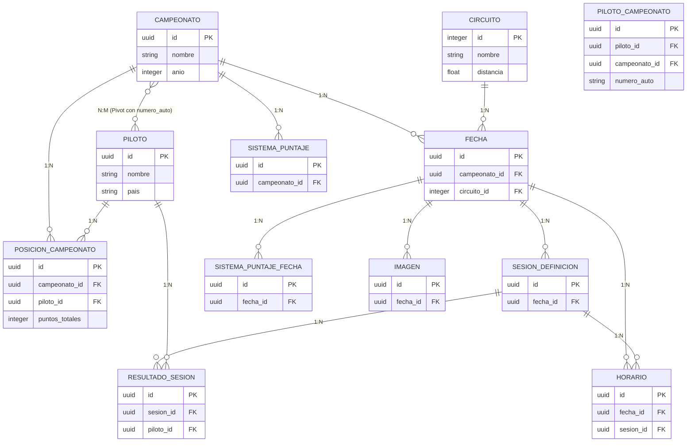

# Documentación Arquitectónica - AdmintinRacing

Esta documentación establece las bases arquitectónicas, estructurales y convenciones del proyecto **AdmintinRacing**, garantizando escalabilidad, mantenibilidad y un código limpio basado en el estándar de Laravel.

---

## 1. Descripción del Dominio

AdmintinRacing es un sistema de gestión deportiva diseñado para la administración integral de competiciones de automovilismo. El sistema centraliza la información de calendarios, pilotos, y resultados en pista.

**Conceptos Core:**
- **Campeonato:** Agrupación anual/estacional de competiciones.
- **Fecha:** Evento de fin de semana que transcurre en un `Circuito` específico y pertenece a un `Campeonato`.
- **Sesión:** Actividad específica dentro de una `Fecha` en la pista (Ej. Entrenamiento, Clasificación, Serie, Final). Cada sesión tiene sus propias reglas de puntuación.
- **Piloto:** Competidor. Se vincula al campeonato mediante un "Número de Auto" único por temporada.
- **Resultados y Puntuaciones:** El núcleo algorítmico del sistema, encargado de transformar los tiempos en pista en un ranking anual (Standings) basado en un sistema dinámico de puntuación.

---

## 2. Diagrama de Entidades

A continuación se presenta el modelo relacional subyacente.



---

## 3. Estructura de Carpetas (Arquitectura Proyectada)

El sistema adoptará una separación en capas (Layered Architecture) respetando los directorios de Laravel, pero añadiendo semántica de Dominio:

```text
app/
├── Http/
│   ├── Controllers/       # Rutas HTTP, orquestación, "Thin Controllers".
│   ├── Requests/          # Validaciones aisladas (FormRequests).
│   └── Resources/         # Transformadores JSON (API Resources).
├── Models/                # Entidades Eloquent, Mutators, Scopes y Relaciones.
├── Policies/              # Lógica de Autorización (Quién puede hacer qué).
├── Services/              # Flujos de negocio complejos (Ej. StandingsService).
├── Actions/               # Clases de única responsabilidad (Ej. ParseOcrResultAction).
├── Events/ & Listeners/   # Reacciones en segundo plano.
└── Jobs/                  # Tareas encolables (Cálculo asíncrono, subida de archivos).
```

---

## 4. Responsabilidades de Cada Capa

### 4.1. Controllers (Controladores)
- **Rol:** Actuar de recepcionista.
- **Debe:** Recibir la petición HTTP, delegar validaciones, invocar a un *Service/Action* u obtener un *Model*, y devolver la respuesta (Vista HTML o JSON).
- **NO Debe:** Contener `if/else` complejos, hacer operaciones matemáticas, ni llamar a `$request->validate()`.

### 4.2. Form Requests
- **Rol:** Guardianes de entrada.
- **Debe:** Validar y sanear todo dato (`string`, `integer`, `exists:table`) que entre al servidor. Emitir los mensajes de error.
- **NO Debe:** Tocar la base de datos para guardar información.

### 4.3. Services y Actions
- **Rol:** Cerebro de la aplicación (Lógica de Dominio).
- **Debe:** Orquestar flujos pesados. Por ejemplo, `CronogramaBuilderService` que toma una Fecha y crea 10 sesiones con sus horarios. `OcrFuzzyMatcherService` que compara nombres de pilotos por aproximación.

### 4.4. Models (Modelos)
- **Rol:** Representación de los datos.
- **Debe:** Definir cómo se relaciona un dato con otro (`hasMany`, `belongsTo`). Transformar cómo entran y salen sus campos de la BD (`Casts`, `Mutators`). Definir filtros reutilizables (`Scopes`).
- **NO Debe:** Contener lógica como generar archivos PDF o hacer llamadas a APIs externas.

### 4.5. API Resources
- **Rol:** Estandarizar la salida.
- **Debe:** Recibir un modelo de base de datos y formatearlo exactamente como lo necesita el frontend de la API, eliminando duplicidad.

---

## 5. Convenciones de Nombres

- **Modelos:** PascalCase, singular. (Ej. `ResultadoSesion`).
- **Controladores:** PascalCase, sufijo "Controller". (Ej. `ResultadoSesionController`).
- **Tablas de Base de Datos:** snake_case, plural. (Ej. `resultados_sesiones`).
- **Tablas Pivot:** snake_case, nombres singulares ordenados alfabéticamente. (Ej. `campeonato_piloto`).
- **FormRequests:** Sufijo "Request" detallando la acción. (Ej. `StoreFechaRequest`).
- **Actions:** Verbo imperativo + Objeto + "Action". (Ej. `CalculateStandingsAction`).
- **Vistas:** snake_case o kebab-case. (Ej. `import-preview.blade.php`).

---

## 6. Flujo de Desarrollo (Workflow)

Cuando se deba crear un nuevo feature complejo (Ej. "*Subida de Penalizaciones masivas por CSV*"):
1. **Rutas:** Definir las rutas HTTP correspondientes (`POST /fechas/{id}/penalizaciones`).
2. **Request:** Crear `ImportarPenalizacionesRequest` para validar el archivo.
3. **Action:** Crear `ProcesarCsvPenalizacionesAction` que ejecute la lógica de parsear el CSV.
4. **Controller:** El controlador recibe el archivo validado e invoca al Action.
5. **Event:** El controlador lanza `PenalizacionesCargadasEvent`.
6. **Listener/Job:** El sistema captura el evento y encola un Job en segundo plano para restar los puntos pertinentes sin hacer esperar a la pantalla del administrador.

---

## 7. Recomendaciones Futuras y Refactorización

Para eliminar la actual deuda técnica del proyecto, se establecen las siguientes prioridades a futuro:

1. **Implementar Form Requests:** Migrar cientos de líneas de validación repetidas en los controladores actuales hacia el directorio `app/Http/Requests`.
2. **Eliminar el N+1 y el O(N³) del Ranking:** Refactorizar el motor de cálculo de `StandingsService` bajando el procesamiento a consultas SQL de agrupación (`GROUP BY`) o encolando el proceso pesados mediante `Laravel Jobs`.
3. **Extraer API Resources:** Limpiar `CampeonatoApiController` y `FechaApiController` creando un `FechaResource` unificado que elimine el 100% de la lógica de presentación duplicada.
4. **Optimizar Búsquedas (PostgreSQL):** Eliminar el `unaccent(lower(CAST($field AS TEXT)))` por defecto en todos lados y evaluar el uso de `Laravel Scout` o Índices Trigram para búsquedas globales.
5. **Componentizar Vistas:** Extraer los elementos comunes de Blade (`badges`, `tablas`, `estados vacíos`) hacia `<x-components>` para limpiar la estructura visual.
