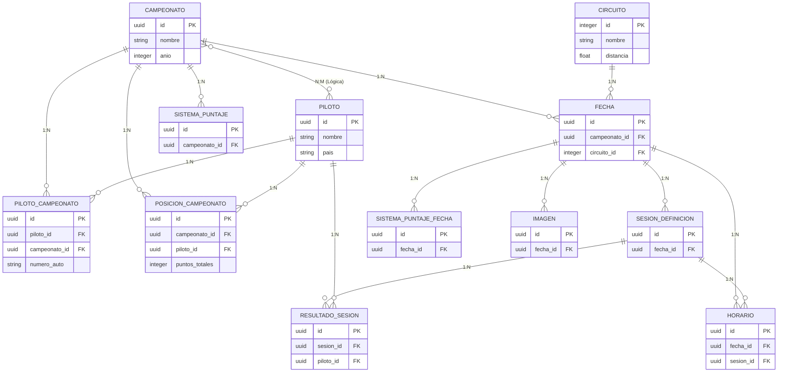

# Diagrama de Relaciones de Modelos (AdmintinRacing)

A continuación se presenta un diagrama Entidad-Relación y la explicación detallada de cómo interactúan los modelos entre sí en tu sistema.

## Diagrama Entidad-Relación (ER)

---

## Explicación de Relaciones

### 1. Many-To-Many (Muchos a Muchos)

- **`Campeonato` y `Piloto`**: Un Campeonato tiene muchos Pilotos inscriptos, y a su vez, un Piloto puede participar en muchos Campeonatos (por ejemplo, corre en Turismo Pista 2024 y en otra categoría o año). 
  - **Tabla Pivot**: Esta relación ocurre a través de la tabla intermedia `pilotos_campeonato` (representada por el modelo `PilotoCampeonato`). Este modelo pivot es vital porque además de unirlos, guarda el `numero_auto`, el cual es específico del piloto para ese campeonato en particular.

### 2. One-To-Many (Uno a Muchos)

- **`Campeonato` -> `Fecha`**: Un campeonato está compuesto por múltiples fechas (carreras del calendario).
- **`Campeonato` -> `PosicionCampeonato`**: Un campeonato tiene múltiples posiciones registradas (la tabla de puntuaciones generales de los pilotos).
- **`Campeonato` -> `SistemaPuntaje`**: Un campeonato tiene múltiples reglas de puntaje base (cuántos puntos otorga ganar la serie, la final, etc.).

- **`Circuito` -> `Fecha`**: Un autódromo o circuito físico alberga muchas fechas a lo largo de su historia.

- **`Fecha` -> `SesionDefinicion`**: Una fecha de carrera (evento de fin de semana) tiene múltiples sesiones de pista en su cronograma (Entrenamientos libres, Clasificación, Final, etc.).
- **`Fecha` -> `Horario`**: Una fecha contiene varios horarios agendados a lo largo del fin de semana.
- **`Fecha` -> `Imagen`**: Una fecha tiene una galería de múltiples imágenes asociadas a ella.
- **`Fecha` -> `SistemaPuntajeFecha`**: Una fecha específica puede tener sistemas de puntuación que sobreescriben la regla general del campeonato (por ejemplo, si esta fecha en particular otorga puntaje doble o especial).

- **`SesionDefinicion` -> `ResultadoSesion`**: Una sesión de pista arroja múltiples resultados. Un resultado corresponde a la actuación de cada piloto en esa sesión exacta.
- **`SesionDefinicion` -> `Horario`**: (*Relación redundante detectada anteriormente*). Una sesión se relaciona actualmente con un modelo `Horario` que guarda su hora de inicio y duración.

- **`Piloto` -> `PosicionCampeonato`**: Un piloto tiene un historial de posiciones o registros de puntos totales logrados en diferentes campeonatos.
- **`Piloto` -> `ResultadoSesion`**: Un piloto tiene cientos de resultados de sesiones registrados a lo largo de su trayectoria.

### 3. One-To-One (Uno a Uno)

En tu base de datos y modelos actuales **no existen relaciones puras `One-To-One`** explícitas (usando `hasOne` / `belongsTo`). 
Sin embargo, hay una que en la lógica de negocio suele serlo:
- **`SesionDefinicion` -> `Horario`**: Aunque el código permite la posibilidad física de que una sesión tenga múltiples horarios (`hasMany`), en un contexto de carreras real (y como sugerí en el informe de diseño), una sesión de pista tiene un **único** horario asignado. En la práctica, es probable que solo haya un registro de `Horario` por cada `SesionDefinicion`.
- **`Piloto` -> `User`** *(Inexistente)*: Como anotación, actualmente no existe una relación entre el modelo de autenticación `User` y `Piloto`. Si los usuarios de tu plataforma son también los pilotos que revisan su telemetría o perfil, esto sería una relación One-To-One clásica a futuro.

### 4. Tablas Huérfanas
- **`User`**: El modelo para la administración/autenticación no posee actualmente relación con ninguna de las entidades del automovilismo. Su uso es puramente administrativo.
